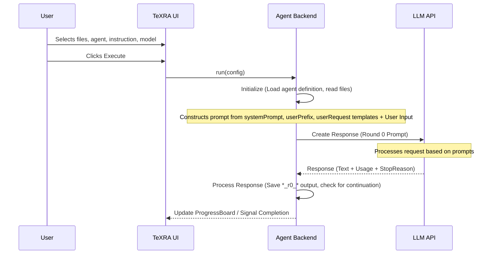

# How TeXRA Agents Work: An Overview

At its core, a TeXRA agent is a recipe for instructing a Large Language Model (LLM) to perform a specific academic research task. This guide provides a high-level overview of how these agents are defined and how they execute your requests.

## Agent Definition Files (`.yaml`)

The core of TeXRA's agent definition lies in a combination of YAML for structure, Jinja2 for templating, and often XML within the prompts for guiding the LLM's output. Each agent's behavior is defined in a `.yaml` file located in the built-in or custom agent directories.

## Understanding the YAML Structure

These `.yaml` files have two main parts (and thankfully, YAML is usually less prickly than XML or JSON):

1.  **`settings`**: Define general operational parameters. For example:
    - `agentType`: Is it a complex `CoT` (Chain of Thought) agent that "thinks" step-by-step, a simpler `direct` agent, or a `toolUse` agent designed to call model-integrated tools?
    - `prefills`: Text the agent should automatically start its response with (e.g., `<scratchpad>`).
    - _(Other settings control output format, inheritance, etc. See [Configuration](./configuration.md) and [Custom Agents](./custom-agents.md) for full details)._
2.  **`prompts`**: Contain text templates that TeXRA fills with your specific context (input files, instructions) to guide the LLM at different stages:
    - `systemPrompt`: Sets the overall role and high-level instructions for the LLM.
    - `userPrefix`: Provides the main context, including your input file(s) (available via e.g., `{{ INPUT_CONTENT }}`) and the specific instruction you typed in the UI (available via `{{ INSTRUCTION }}`).
    - `userRequest`: Asks the LLM to perform the initial task (Round 0). Often instructs the LLM to think within `<scratchpad>` tags and then output the main content wrapped within the XML tags defined by `settings.documentTag` (e.g., `<document>...</document>`).
    - `userReflect`: Asks the LLM to review and improve its first response (Round 1, only used if "Reflect" is enabled).

\_(Prompts use Jinja2 templating. For a detailed list of available variables like `{{ INPUT_CONTENT }}` and how to use them, see the [Custom Agents](./custom-agents.md) guide.)\*

::: tip Transparency & Customization
The prompts described above (`systemPrompt`, `userPrefix`, etc.) represent TeXRA's structured approach to guiding the LLM. This structured, template-based system means the agent's behavior is transparent and highly customizable through the `.yaml` file, not a hidden black box.
:::

## Basic Execution Flow

When you click "Execute" in the TeXRA UI, TeXRA uses the selected agent's definition (`.yaml`) and your UI inputs to interact with the chosen LLM:

**Key Stages:**

1.  **Initialization:** TeXRA loads the agent definition and reads the files you selected.
2.  **Prompt Construction:** It combines the agent's `systemPrompt`, `userPrefix` (filled with your files and instruction), and `userRequest` templates into a full prompt for the LLM.
3.  **LLM Interaction (Round 0):** TeXRA sends the prompt to the selected LLM API. The LLM generates a response, typically including reasoning (`<scratchpad>`) and the final answer wrapped in XML tags (e.g., `<document>...</document>`).
4.  **Processing:** TeXRA saves the raw LLM response (often as an `.xml` file internally). It then parses this file, extracts the content from the primary XML tag (defined by `settings.documentTag`), and saves _that extracted content_ to the final output file (e.g., `filename_agent_r0_model.tex`). You can monitor this in the [ProgressBoard](./progress-board.md). For LaTeX files, TeXRA can also automatically generate a `latexdiff` file comparing the output to the input, enhancing observability. See the [LaTeX Diff guide](./latex-diff.md) for details.

**Continuation Handling:** If the LLM response gets cut off due to output token limits before generating the required `endTag`, TeXRA automatically sends a continuation prompt. This prompt asks the model to resume generating exactly where it left off, ensuring complete outputs even for very long tasks. This happens seamlessly within a processing round.

### Prompt Composition and Message Flow

TeXRA constructs the conversation by merging your agent's `systemPrompt`, the context-filled `userPrefix`, and the `userRequest`. Depending on settings, the extension may insert additional messages in between—for example the output of `texcount` when you enable **Attach TeX Count**, or encoded images and audio files selected in the file panel. The sequence is not a fixed "system–user–system" pattern: attachments or tool results can be inserted at any point before the LLM generates a single response containing `<scratchpad>` reasoning followed by the XML-wrapped output defined by `settings.documentTag`.

**Optional Reflection (Round 1):**

If you enable the "Reflect" option in the Tool Config section of the UI, TeXRA performs an additional step after Round 0 finishes successfully:

1.  **Reflection Prompt:** It uses the agent's `userReflect` prompt template to ask the LLM to critique and improve its own Round 0 output (which is included in the conversation history).
2.  **LLM Interaction (Round 1):** The LLM generates a revised response.
3.  **Processing:** TeXRA saves this refined output to a separate file (e.g., `filename_agent_r1_model.ext`).

This basic flow, potentially with the reflection step, allows TeXRA agents to perform targeted tasks based on their specific definitions and your instructions. For concrete examples of built-in agents, see the [Built-in Agent Reference](./built-in-agents.md).

::: warning Potential XML Issues
Occasionally, LLMs might generate slightly malformed XML (e.g., missing closing tags), especially with very long or complex outputs. If TeXRA fails to extract content from an agent's output (`_r0_*.xml` or `_r1_*.xml` file), you might need to manually inspect the `.xml` file and correct any structural errors (like adding a missing `</document>` tag) before TeXRA can process it correctly. See the [Troubleshooting guide](../reference/troubleshooting.md#output-file-corruption) for more details.
:::

### Reflection

After generating an initial output (Round 0), TeXRA agents with reflection enabled evaluate and refine their work (Round 1):

  

    <button type="button" class="pdf-tab active" data-pdf="/examples/draft_polish_r0_gemini25p_diff.pdf">Original vs. Round 0</button>
    <button type="button" class="pdf-tab" data-pdf="/examples/draft_polish_r1_gemini25p_diff.pdf">Original vs. Round 1</button>
    <button type="button" class="pdf-tab" data-pdf="/examples/draft_polish_r1_gemini25p_diffr1r0.pdf">Round 0 vs. Round 1</button>
  

  <iframe src="/examples/draft_polish_r1_gemini25p_diffr1r0.pdf" id="pdf-frame" class="reflection-pdf-frame"></iframe>
  <a href="/examples/draft_polish_r1_gemini25p_diffr1r0.pdf" target="_blank" id="pdf-link" class="reflection-pdf-link">View full example</a>

  
Red strikethrough: Round 0 content revised in Round 1

  
Blue underlined: New/improved content added in Round 1

