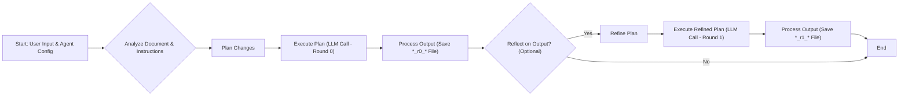

# Introduction to TeXRA

Welcome to TeXRA, your intelligent academic research assistant integrated directly into VS Code. This guide will help you understand what TeXRA is, how it works, and how it can enhance your academic research workflow.

<a href="https://marketplace.visualstudio.com/items?itemName=texra-ai.texra" target="_blank" style="display: inline-block; background-color: #007ACC; color: white; padding: 10px 15px; text-decoration: none; border-radius: 4px; font-weight: bold; margin: 10px 0;">Install from VS Code Marketplace</a>

## What is TeXRA?

TeXRA is a VS Code extension designed to harness the power of large language models (LLMs) for academic research and writing. It provides a seamless interface to work with these advanced AI models directly within your writing environment, enabling you to focus on your brilliant ideas while the AI helps wrangle the LaTeX and refine the prose.

Unlike general-purpose AI interfaces like ChatGPT or Claude, TeXRA is specifically optimized for academic workflows, with special attention to LaTeX documents, mathematical notation, technical figures, and the rigorous requirements of scholarly writing.

## The Philosophy Behind TeXRA

TeXRA was developed based on the observation that current large language models possess remarkable capabilities for scientific research and academic research that are often underutilized. The extension implements an approach inspired by key AI design patterns:

1. **Reflection**: The LLM examines its own work to identify improvements
2. **Tool use**: The LLM leverages external tools to gather information or process data
3. **Planning**: The LLM develops and executes multi-step plans to achieve complex goals

Through these patterns, TeXRA creates an iterative process that mimics expert academic research - analyzing documents, planning improvements, executing changes, and refining output through self-reflection.

## Key Features

TeXRA offers a comprehensive set of features designed for academic workflows:

### Specialized AI Agents

- **Correction**: Fix errors and improve formatting
- **Enhancement**: Polish writing style and clarity
- **Creation**: Generate figures, tables, and new content
- **Transformation**: Convert between different document formats

### LaTeX Integration

- Seamless processing of LaTeX documents
- TikZ figure extraction and creation
- LaTeX diff functionality for version comparison
- Intelligent merging of document versions

### Multi-modal Support

- Process text, images, and PDFs in a unified interface
- Create and modify visual elements within documents
- Handle mathematical notation with precision

### Workflow Tools

- Version management and comparison
- File organization and batch processing
- Integration with external academic tools

## How TeXRA Works

At its core, TeXRA follows an iterative process inspired by expert workflows:

This process leverages the strengths of language models while addressing their limitations through structured workflows, optional self-reflection, and specialized tools.

## Who Should Use TeXRA?

TeXRA is designed for:

- **Researchers** writing academic papers, grants, or reports
- **Professors** creating lecture notes, slides, or educational materials
- **Students** working on theses, dissertations, or complex assignments
- **Technical writers** producing documentation with mathematical content
- **Anyone** working with complex scholarly documents, especially in LaTeX

## Getting Started

Ready to enhance your academic research with TeXRA? The next sections will guide you through:

- [Installation](/guide/installation): Setting up TeXRA and its dependencies
- [Quick Start](/guide/quick-start): Your first steps with TeXRA
- [Core Concepts](/guide/built-in-agents.md): Understanding the fundamental components
- [Advanced Usage](/guide/latex-diff): Leveraging powerful features
- [Customization](/guide/configuration): Tailoring TeXRA to your needs

## Data Privacy & Security

TeXRA prioritizes your privacy. All API calls to language models (like Anthropic Claude, OpenAI GPT, Google Gemini) are made **directly from your local VS Code instance** to the respective provider's API endpoint (or OpenRouter, if configured).

**Your document content and API keys are NOT sent to or stored on any TeXRA servers.**

API keys are stored securely using VS Code's built-in Secret Storage.

While TeXRA itself doesn't store your data, be aware of the data usage and privacy policies of the specific AI model providers you choose to use.

Let's begin your journey toward more efficient and effective academic research!

If you spot a bug, feel free to email us at [contact@texra.ai](mailto:contact@texra.ai).
